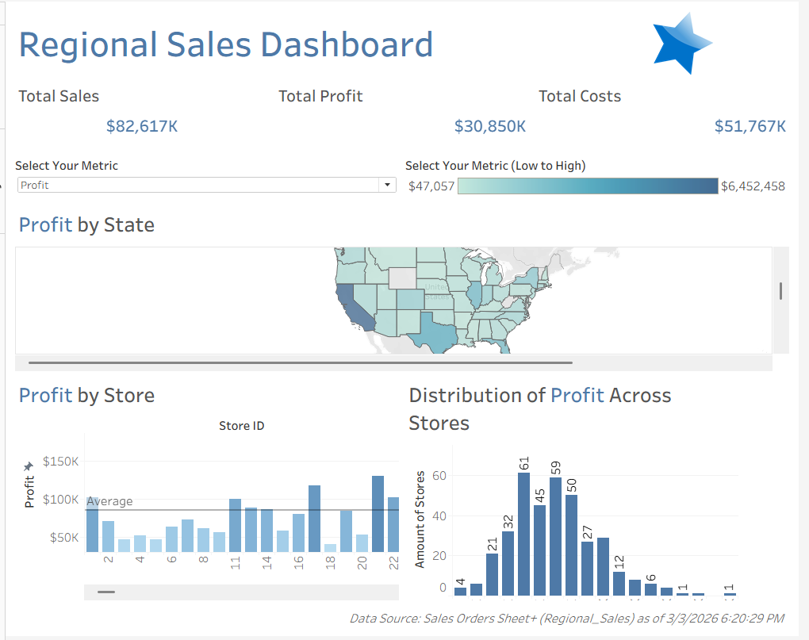
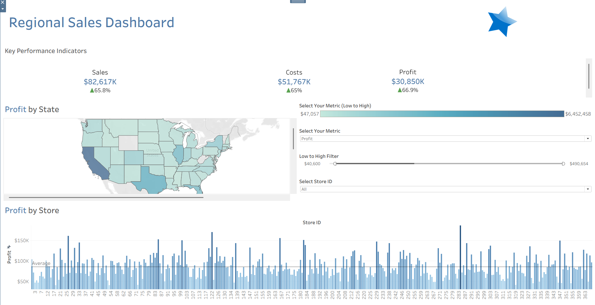

# Regional_Sales_Dashboard
The interactive dashboard highlights store performance through multiple lenses. Together, these visualizations support analyzing sales performance, profitability, and cost distribution across regions, states, and individual stores.

## Dashboard Approach
Using the same dataset, I developed two dashboard versions with slightly different analytical perspectives and design approaches. The Regional Sales Dashboard helps stakeholders monitor overall business performance while drilling down into regional and store-level insights.

The dashboard highlights:

- Total Sales

- Total Profit

- Total Costs

- Profit performance by state

- Profit distribution across stores

- Store-level profitability comparison

With this dashboard, users can answer questions regarding which states generate the highest profit, are profits concentrated in a few stores or evenly distributed, which stores are performing above/below average, and how do sales, costs, and profit compare overall.

### Dashboard Example 1

- High-level view of store performance across metrics  
- Geographic visualization by state  
- Quick benchmarking with reference lines  
- Designed for executives to assess overall performance

### Dashboard Example 2

- Identify top and underperforming stores  
- Support regional strategy and resource allocation  
- Enable data driven operational decisions  
- Guide strategic growth and expansion planning
